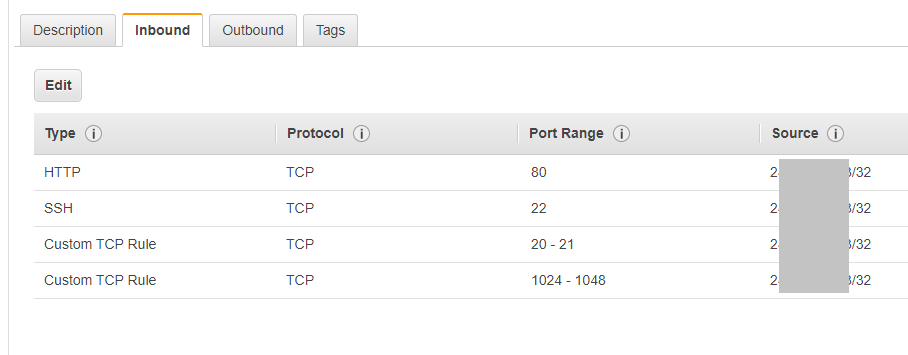
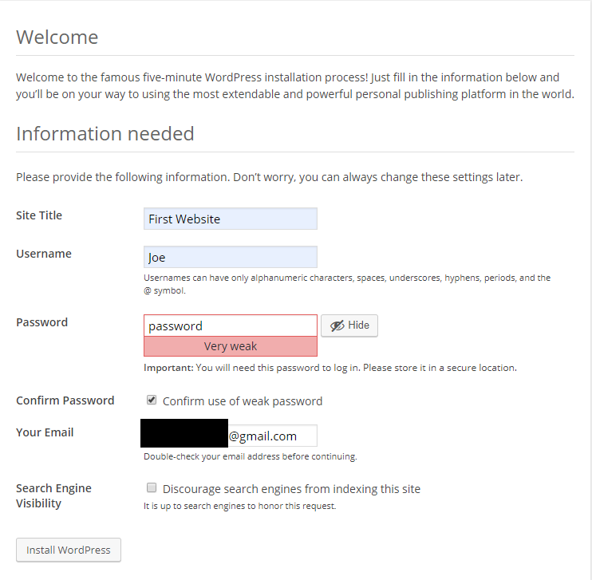

# Demo

## Target Account Setup

1. Create a brand new account called "khartman-demo1"
2. Enable Guard Duty
3. Make a Cloudwatch logs Group for Flow Logs, named "khartman-demo1-flowlogs"
4. Enable Flow Logs (both Accept & Reject)
5. Enable CloudTrail to s3 bucket (aws-cloudtrail-logs-675556673290-management-events-cbeb188d) and CloudWatch Logs (aws-cloudtrail-logs-675556673290-30363060). Also enable CloudTrail Insights.
6. Make a bucket for config (khartman-demo1-config)
7. Enable Config Enable. (Bucket is config-bucket-675556673290). No Rules to start
8. Enable Security Hub
9. Make an IAM user named "Joe" and grant the "AmazonEC2FullAccess" permission.

## Make an Intentionally Vulnerable WordPress EC2 Instance

1. Follow [this process](https://docs.aws.amazon.com/AmazonCloudWatch/latest/monitoring/create-iam-roles-for-cloudwatch-agent.html) to create the **CloudWatchAgentServerRole**

2. Launch a t2.micro Amazon Linux EC2 instance that is tagged with "Name"="WP". For now, add it to a security group that allows connections from __only your ip address__. Attach the Role to the Instance that was created in the previous step.

Make a new security group called "wordpress" and add the inbound rules as shown below:



**NOTE:** Do not use Amazon Linux 2 or the vulnerable packages will not be available.

3. SSH into the instance.

4. Run [this chunk of code](./wordpress-config.sh) on the instance.

5. Exit SSH and the ssh back in and run the following commands to delete the bash history.

```
sudo rm -f /root/.bash_history
sudo rm -f /home/ec2-user/.bash_history
```

6. Confirm that the CloudWatch Agent is shipping Logs!!

7. Open the default webpage of your EC2 instance by posting the IP address in your address bar. Select "English" and then it will redirect to a page that allows you to configure WordPress.



Enter the information as shown in the screenshot, above. Use the literal word 'password' as the password as we want to make it easy for this site to get popped. Provide an email address that you have access to but cannot be used to identify you by the attacker.

**NOTE** Once you hit the **Install WordPress** button, you will be redirected to the WordPress dashboard. DO NOT update WordPress or any plugins!

8. The last step of the script installed some vulnerable plugins. Next, lets activate them. On the left-side menu, click the "Plugins" menu item, then select "Installed Plugins".

Activate the following plugins:
* GB Gallery Slideshow
* Instant highlighter
* SQL Table Lookup

9. Set the Theme by clicking the "Appearance" menu item and then select the "Twenty Fourteen" theme.

10. Make a note of which availability zone and VPC that the WordPress instance is hosted in. Now set up a load balancer.
  * In the EC2 Console, select "Load Balancers" and then click **Create Load Balancer**.
  * Select "Application Load Balancer" as the type by clicking on the corresponding **create** button.
  * Give the ALB the name of "wordpress" in all lowercase.
  * Select the availability zone that your instance is running in and one other AZ. (The ALB requires 2 AZs.)
  * Click the **Next: Configure Security Groups** button
  * Click the "create new security group" radio button. Name the sg "wordpress-alb" and accept the default rule of TCP 80 from anywhere.
  * Click the **Next: Configure Routing** button to create a new target group.
  * Set the name to "wordpress" and leave everything else the default.
  * Click the **Next: Register Targets** button.
  * Click the checkbox next to the WP instance and then click the **Add to registered** button. Then, click the **Next Review** button.
  * Lastly, click the **Create** button and when it is done click the **Close** button.
  * When the state of the ALB has changed from "provisioning" to "active" proceed to the next step.
  * On the Description tab of the Load Balancer detail, scroll to the botton of tab page and click the **Edit attributes** buton. Click the checkbox for Access logs. This will display a subform to enter in the name of a new bucket. Enter in "wordpress-alb-9999" where the 9999 is some random number. Be sure to click the **Create this location for me** checkbox.

11. Modify the "wordpress" security group by allowing HTTP (port 80) in from the sg-id that corresponds to the "wordpress-alb" security group.

## Set up the KALI Linux EC2 Instance

1. In another account, Spin up a Kali EC2 Instance. Allow SSH from YOUR IP address and allow all TCP from the IP address of the EC2 Instance.

2. Run the following commands:

```
sudo su
apt update -y && apt upgrade
apt install -y nmap nikto wpscan metasploit-framework
exit
```

## Configure the Custom Threat List

1. In the "Logging" AWS Account, create a bucket named "guardduty-threatlist-999999999" in the US East (Ohio) region. (Replace 999999999 with the Account Number.)
2. Make a text file named "custom-threat-list.txt" and add to the file the Public IP address of the Kali Linux instance.
3. Upload the custom-threat-list.txt to the guardduty-threatlist bucket.
4. Switch to the GuardDuty service. Make sure you are in the OHIO region.
5. From the Left-Hand menu, select "Lists" and then click "+ Add a threat list." Enter the following:
  * List Name: Custom Threat List
  * Location:  https://s3.amazonaws.com/guardduty-threatlist-999999999/custom-threat-list.txt
  * Format: Plaintext
6. Make sure to activate it in GuardDuty.


## Weaken the Security of the Cloud Environment

1. Allow a few days to pass and then log in as user "Joe" and open up all rules to allow access from the Kali Linux External IP Address. Make the SSH Rule Accessible from Everywhere.

**NOTE:** This is meant to simulate the opening up of all Security Group Rules to allow access from everywhere. During this public demo, however, I only want the system to be attacked from the Kali instance and not from the demo audience.
